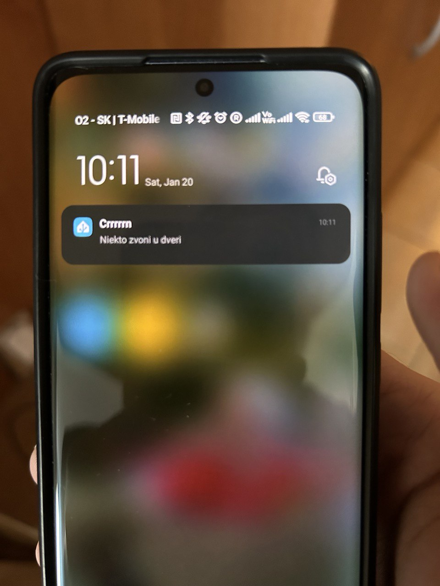
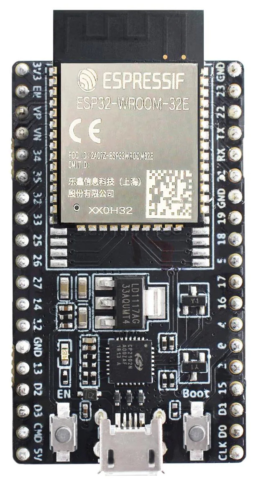
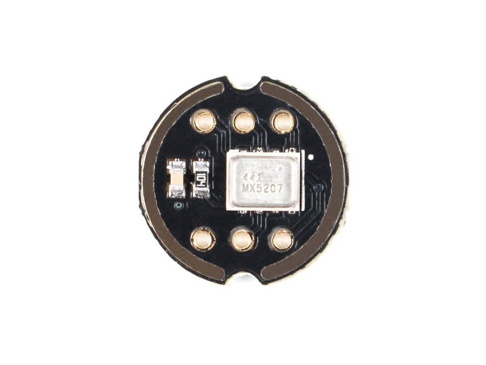
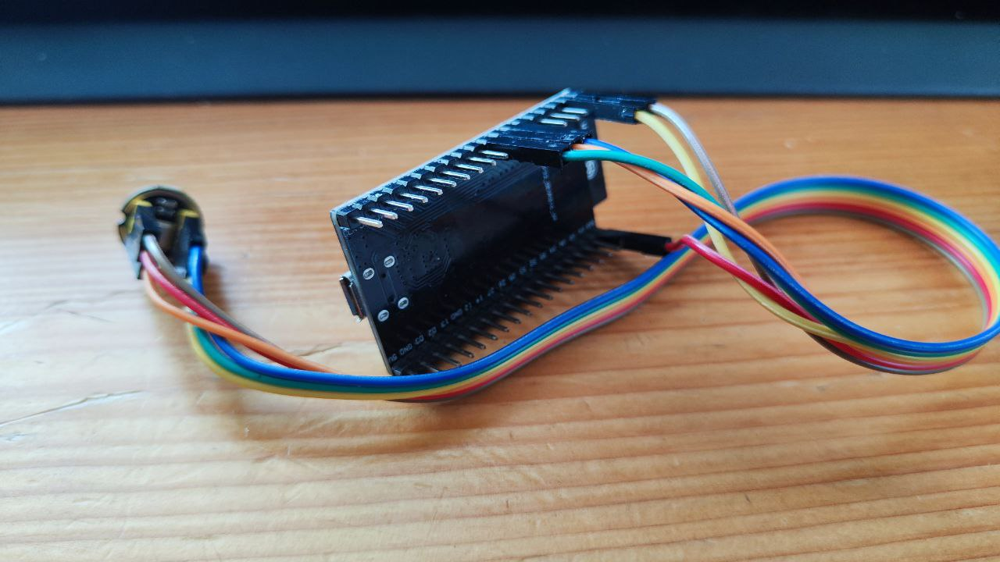

# esphome_sound_source_detection

This component identify sound source based on frequency.

If anybody is interested in supporting my "sleepless" nights (working mostly between 23:00-3:00) on different projects press:

[](https://www.buymeacoffee.com/hadatko)

Thank you ;)

Ideas are welcome. But PRs are welcome more ;)

## History

My colleague ask me to create software for his HW to be able detect sound source and be able to process that in home assistant. Even my wife :D like this solution and want keep one sample at home.

Source code for sound analyzes are based on this article: [Smart door bell and noise meter using FFT on ESP32](https://iotassistant.io/esp32/smart-door-bell-noise-meter-using-fft-esp32/). You can also find science background to this problematic. So the actual work was integrate this code with esphome.

`!!! Never worked with Esphome before, so the code may looks terrible and some parts may need change.`

## Real case

Intention was be able to detect door bell sound and push notification into Home assistant, which can do whatever user want. E.g. Send notification to the mobile phone

In the video first time it didn't work as i set bell value to 183 and it measured 182. So i need decrease the value i am looking for, or have range.

<div style="display:flex; justify-content: space-between; align-items: center;"    >
<video width="400" controls>
  <source src="media/demo.mp4" type="video/mp4" />
  Your browser does not support HTML video.
</video>


</div>

## Dependency

To make the code working i have to create PR in official release, which was accepted quite quickly [PRs](https://github.com/esphome/esphome/pull/6056/files). In a time writing this doc: Although it was merged at 9.1.2024 it was not yet released. If there will be a official release please let me know, so i can update Readme. By the time you need apply these changes by yourself.

For that reason for building application i was using this steps [setup-dev-env](https://esphome.io/guides/contributing#setup-dev-env) and i was flashing image to board using [https://web.esphome.io/](https://web.esphome.io/).

## HW

Hw was chosen by colleague and i think it is based on what was used in article mentioned in History section. So in my case `ESP32_DEVKIT_V4` + `inmp441`

<div style="display:flex; align-items: center;"    >

++++++++++++++++

================

</div>

## yaml

At least two different approach can be used.

* First approach is do not set any specific binary sensor in yaml. Then in e.g. Home assistant you need to analyze values which are sent from this device and create automatization triggering event, when value match your needs (e.g. if sensor.currentValue is 160 then send notification).

```yaml
esphome:
  name: sounddetector

esp32:
  board: esp32dev
  framework:
    type: arduino

# logger:
#   level: VERY_VERBOS

# Enable Home Assistant API
api:
  encryption:
    key: "H8sN4oR4ldRe01BuqEU+uQujPqqSdVU+3lICyMZfn94a5Dd="

# Wi-Fi
wifi:
  networks:
  - ssid: "?" #fill your wifi ssid
    password: "" #fill your wifi password
    # Enable fallback hotspot (captive portal) in case wifi connection fails
  ap:
      ssid: "Hotspot_MIC"
      password: "totalySecretPassword"

captive_portal:

i2s_audio:
  i2s_lrclk_pin: GPIO18 # depends your wiring
  i2s_bclk_pin: GPIO23 # depends your wiring

microphone:
  - platform: i2s_audio
    id: external_mic
    adc_type: external # based on article mentioned in History section
    i2s_din_pin: GPIO19 # depends your wiring
    pdm: false # based on article mentioned in History section
    bits_per_sample: 32bit # based on article mentioned in History section
    sample_rate: 22627  # based on article mentioned in History section
    use_apll: true # based on article mentioned in History section

detect_audio: # this component analyzes the input from mic, and its source code is the main part of this PR
  id: "detect_audio_id"

switch:
  - platform: template
    name: "Mic ON"
    turn_on_action:
      - microphone.capture:
    turn_off_action:
      - microphone.stop_capture:
    lambda: return id(external_mic).is_running();

button:
  - platform: template
    name: Clear metrics
    id: clear_metrics
    on_press:
      - lambda: id(detect_audio_id).clearMetrics();

sensor:
  - platform: template
    lambda: |-
      return id(detect_audio_id).getCurrentPeak();
    name: "Current peak value"
    update_interval: 500ms
  - platform: template
    lambda: |-
      return id(detect_audio_id).getCurrentLoudness();
    name: "Current loudness value"
    update_interval: 500ms
  - platform: template
    lambda: |-
      return id(detect_audio_id).getLoudnessSum();
    name: "Total loudness"
    update_interval: 500ms
  - platform: template
    lambda: |-
      return id(detect_audio_id).getLoudnessMax();
    name: "Max loudness"
    update_interval: 500ms
  - platform: template
    lambda: |-
      return id(detect_audio_id).getLoudnessMin();
    name: "Min loudness"
    update_interval: 500ms

# dummy binary sensor as i have Template binary sensor include in src
binary_sensor:
  - platform: template
    id: "bell"
    lambda: |-
      return id(bell).state;
    name: "Bell1"
    publish_initial_state: true
```

* Second approach is to defined sensor directly in yaml file. In this case extend previous yaml with:

```yaml
esphome: #add bellow lines under this section
  on_boot:
    then:
      lambda: id(detect_audio_id).addSoundSource(id(bell1), 182); #first custom sensor. Parameters (binary_sensor bell1, trigger peak value)
              id(detect_audio_id).addSoundSource(id(bell2), 45); #second custom sensor. Parameters (binary_sensor bell2, trigger peak value)
              # add more here and meet definition in binary_sensor bellow

binary_sensor: #you can remove temp binary sensor from above and add your custom sensors here
  - platform: template  #first custom sensor
    id: "bell1"
    lambda: |-
      return id(bell1).state;
    name: "Bell1"
    publish_initial_state: true
  - platform: template #second custom sensor
    id: "bell2"
    lambda: |-
      return id(bell2).state;
    name: "Bell2"
    publish_initial_state: true
  # add more here and meet calls in esphome/on_boot configuration above
```

`I think this solution has its cavities, which are caused as mentioned lack of knowledge of this SDK. So maybe somebody come up with better solution.`

## Testing

For testing hw + sw you can use real device, but it can be handy if you install any `Frequency Generator` into your mobile. You can set `1000HZ` and you should get peak `45`. Also you can enable debug logs and catch them trough usb serial cable connected to your computer.

## Last words

I hope my work will help some people to solve their issues, bring some happiness.
